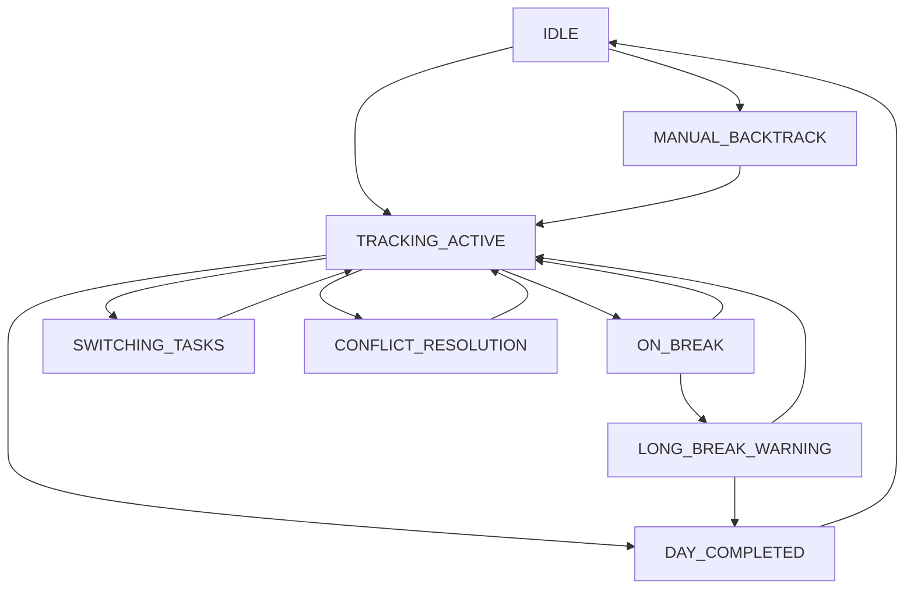
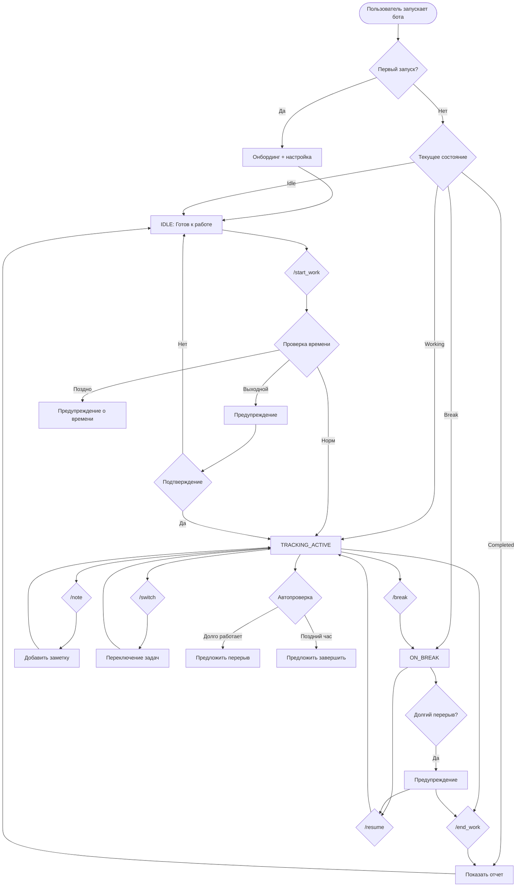

# 🎯 **User Flow Design для Work Tracker Bot**

Отлично, что бот запустился! Теперь нужно продумать все возможные пользовательские сценарии и крайние случаи. Это критически важно для создания интуитивного и надежного UX.

***

# 📋 **БАЗОВЫЕ USER FLOWS**

## 🟢 **Flow \#1: Стандартный рабочий день (Happy Path)**

### **🌅 Утренний сценарий:**

```mermaid
START → /start_work "Проверка почты" → TRACKING_ACTIVE
```

**Пользователь:**

1. `09:00` Приходит на работу
2. Открывает Telegram → бот
3. Нажимает `/start_work` или кнопку "▶️ Начать работу"
4. Пишет: `"Проверка почты и планирование дня"`
5. **Бот отвечает:**

```
▶️ Начал отслеживание: "Проверка почты и планирование дня"
🕘 Начало: 09:02

[⏸️ Пауза] [📝 Заметка] [⏹️ Завершить]
```


### **🍽️ Обеденный перерыв:**

```mermaid
TRACKING_ACTIVE → /break "Обед" → BREAK_ACTIVE → /resume → TRACKING_ACTIVE
```

**Пользователь:**

1. `13:00` Нажимает `⏸️ Пауза` или `/break`
2. Пишет: `"Обед"`
3. **Бот отвечает:**

```
⏸️ Пауза: "Обед"
⏱️ Отработано: 3ч 58мин

[▶️ Продолжить] [📝 Заметка] [⏹️ Завершить день]
```

4. `14:00` Нажимает `▶️ Продолжить` или `/resume`
5. Пишет новую активность: `"Разработка API"`

### **🏠 Конец дня:**

```mermaid
TRACKING_ACTIVE → /end_work → IDLE + DAILY_REPORT
```

**Пользователь:**

1. `18:00` Нажимает `⏹️ Завершить день` или `/end_work`
2. **Бот отвечает:**

```
✅ Рабочий день завершен!

📊 ОТЧЕТ ЗА ДЕНЬ:
🕘 Общее время: 8ч 2мин
⏰ Чистое время: 7ч 2мин
🍽️ Перерывы: 1ч 0мин

📋 Активности:
• Проверка почты: 1ч 15мин
• Разработка API: 4ч 20мин  
• Code review: 1ч 27мин

💪 Продуктивность: 88%
```


***

## 🟡 **Flow \#2: Быстрые заметки во время работы**

### **📝 Добавление заметки:**

```mermaid
TRACKING_ACTIVE → /note "Решение" → TRACKING_ACTIVE
```

**Пользователь:**

1. Во время работы нажимает `📝 Заметка` или `/note`
2. Пишет: `"Решили использовать PostgreSQL вместо MySQL для нового проекта"`
3. **Бот отвечает:**

```
📝 Заметка добавлена к текущей активности
🕘 Время: 15:23
💼 Активность: "Разработка API"

[📋 Все заметки] [◀️ Назад к работе]
```


***

## 🟢 **Flow \#3: Работа с несколькими задачами**

### **🔄 Переключение между задачами:**

```mermaid
TASK_A → /switch "Task B" → TASK_B → /switch "Task C" → TASK_C
```

**Пользователь:**

1. Работает над "Разработка API"
2. Прерывается на срочную задачу: `/start_work Исправление бага в продакшне`
3. **Бот отвечает:**

```
🔄 Переключение задач:
⏸️ Приостановлено: "Разработка API" (2ч 15мин)
▶️ Начато: "Исправление бага в продакшне"

[🔙 Вернуться к API] [📝 Заметка] [⏹️ Завершить]
```


***

# 🔴 **КРАЙНИЕ СОСТОЯНИЯ И EDGE CASES**

## ⚠️ **Edge Case \#1: Забыл начать трекинг**

### **Сценарий:** Пользователь работает, но забыл включить трекинг

**Пользовательский Flow:**

```mermaid
IDLE → [11:00] /start_work "Уже работаю 2 часа" → MANUAL_BACKTRACK
```

**Обработка:**

1. Пользователь: `/start_work Работаю над проектом уже 2 часа`
2. **Бот анализирует текст и отвечает:**

```
🤔 Вижу, что вы уже работаете!

Хотите задним числом добавить время?
[⏮️ Начать с 09:00] [⏮️ Начать с 10:00] [▶️ Начать сейчас]

Или укажите точное время начала:
```

3. Пользователь выбирает опцию или пишет время
4. Бот корректирует запись в базе

***

## ⚠️ **Edge Case \#2: Забыл завершить день**

### **Сценарий:** Ушел домой, не выключив трекинг

**Автоматическая обработка:**

```python
# Логика в боте
if current_time > 20:00 and user_status == "TRACKING_ACTIVE":
    send_message("🏠 Вы забыли завершить рабочий день?")
    show_options([
        "✅ Завершить в 18:00",
        "🕘 Завершить в другое время", 
        "🔄 Продолжаю работать"
    ])
```

**User Flow:**

1. `20:30` **Бот автоматически пишет:**

```
🏠 Рабочий день длится уже 11ч 30мин!

Возможно, вы забыли завершить трекинг?

[✅ Завершить в 18:00] [🕘 Другое время] [🔄 Продолжаю]
```

2. Пользователь выбирает вариант
3. Бот корректирует данные

***

## ⚠️ **Edge Case \#3: Двойное начало работы**

### **Сценарий:** Пользователь случайно нажал /start_work дважды

**Защитная логика:**

```mermaid
TRACKING_ACTIVE → /start_work → CONFLICT_RESOLUTION
```

**User Flow:**

1. Статус: уже идет трекинг "Разработка API"
2. Пользователь: `/start_work Код ревью`
3. **Бот отвечает:**

```
⚠️ У вас уже идет трекинг задачи:
"Разработка API" (1ч 23мин)

Что делаем?
[🔄 Переключиться] [➕ Продолжить текущую] [⏸️ Пауза + новая]
```


***

## ⚠️ **Edge Case \#4: Длинные перерывы**

### **Сценарий:** Перерыв длится больше 2 часов

**Мониторинг перерывов:**

```python
if break_duration > 2_hours:
    send_notification("⏰ Перерыв длится уже 2 часа. Продолжаем работать?")
```

**User Flow:**

1. Пользователь на перерыве 2+ часа
2. **Бот напоминает:**

```
⏰ Перерыв "Обед" длится уже 2ч 15мин

Все в порядке?
[▶️ Продолжить работу] [🏠 Завершить день] [😴 Больничный]
```


***

## ⚠️ **Edge Case \#5: Работа в выходные**

### **Сценарий:** Пользователь работает в субботу/воскресенье

**Умное уведомление:**

```mermaid
WEEKEND + /start_work → WEEKEND_WARNING → CONFIRM_WEEKEND_WORK
```

**User Flow:**

1. Суббота, 10:00: `/start_work Доделываю проект`
2. **Бот отвечает:**

```
🗓️ Сегодня выходной!

Уверены, что хотите работать?
[💪 Да, работаю] [📋 Личный проект] [❌ Ошибка]

Тип дня: [🏢 Работа] [🏠 Личное] [🚨 Срочно]
```


***

## ⚠️ **Edge Case \#6: Сбой интернета/бота**

### **Сценарий:** Бот недоступен, но работа продолжается

**Recovery Flow:**

1. Бот возвращается онлайн
2. **Проверяет последнюю активность:**

```
🔄 Снова на связи!

Последняя активность: "Разработка API"
Начало: 14:30 (3 часа назад)

Что произошло за время моего отсутствия?
[▶️ Продолжал работать] [⏸️ Делал перерыв] [🏠 Завершил день]
```

3. Бот восстанавливает данные на основе ответа

***

# 🔄 **СОСТОЯНИЯ БОТА (State Machine)**




## **📊 Детальные состояния:**

| Состояние | Описание | Доступные команды | Переходы |
| :-- | :-- | :-- | :-- |
| **IDLE** | Не работает | /start_work, /stats, /help | → TRACKING_ACTIVE |
| **TRACKING_ACTIVE** | Активно работает | /break, /note, /end_work, /switch | → ON_BREAK, DAY_COMPLETED |
| **ON_BREAK** | На перерыве | /resume, /note, /end_work | → TRACKING_ACTIVE, DAY_COMPLETED |
| **DAY_COMPLETED** | День завершен | /stats, /start_work (новый день) | → IDLE |
| **SWITCHING_TASKS** | Переключение задач | Inline кнопки выбора | → TRACKING_ACTIVE |
| **CONFLICT_RESOLUTION** | Разрешение конфликтов | Inline кнопки выбора | → TRACKING_ACTIVE |


***

# 💬 **ИНТЕЛЛЕКТУАЛЬНЫЕ ОТВЕТЫ БОТА**

## **🧠 Контекстные ответы на основе времени:**

```python
def get_contextual_greeting(hour):
    if 6 <= hour < 10:
        return "🌅 Доброе утро! Готовы к продуктивному дню?"
    elif 10 <= hour < 13:
        return "☀️ Доброе утро! Как дела с утренними задачами?"
    elif 13 <= hour < 14:
        return "🍽️ Время обеда! Или продолжаем работать?"
    elif 14 <= hour < 18:
        return "⚡ Добрый день! Во второй половине дня самое время для фокуса!"
    elif 18 <= hour < 22:
        return "🌆 Добрый вечер! Еще работаете или день завершен?"
    else:
        return "🌙 Поздний час... Не перерабатываете?"
```


## **📊 Умная аналитика в режиме реального времени:**

```python
def get_real_time_insights(current_session, today_stats):
    insights = []
    
    # Анализ текущей сессии
    if current_session['duration'] > 3600:  # Больше часа
        insights.append("💪 Отличная концентрация! Уже час работаете без перерыва")
    
    # Сравнение с обычным паттерном
    if today_stats['productivity'] > user_avg_productivity:
        insights.append("📈 Сегодня вы более продуктивны чем обычно!")
    
    # Предложения
    if current_time.hour == 13 and not today_stats['had_lunch']:
        insights.append("🍽️ Пора пообедать? Перерывы важны для продуктивности")
    
    return insights
```


***

# 🛡️ **ОБРАБОТКА ОШИБОК И ВОССТАНОВЛЕНИЕ**

## **🔧 Типичные сценарии ошибок:**

### **1. База данных недоступна:**

```python
async def handle_db_error():
    return (
        "⚠️ Временные проблемы с сохранением данных\n"
        "Ваша сессия продолжается в памяти\n"
        "Данные будут восстановлены автоматически"
    )
```


### **2. Неопознанная команда:**

```python
async def handle_unknown_command(text):
    suggestions = find_similar_commands(text)
    return f"""
🤔 Не понял команду "{text}"

Возможно, вы имели в виду:
{format_suggestions(suggestions)}

Или используйте /help для списка команд
"""
```


### **3. Некорректные данные:**

```python
async def handle_invalid_time(time_input):
    return (
        "⏰ Не могу понять время\n"
        "Примеры правильного формата:\n"
        "• 09:30\n"
        "• 2 часа назад\n"
        "• 15 минут назад"
    )
```


***

# 📱 **АДАПТИВНЫЙ UX ДЛЯ РАЗНЫХ УСТРОЙСТВ**

## **💻 Desktop Telegram:**

```python
# Более подробные кнопки и текст
keyboard = [
    ["▶️ Начать работу", "⏸️ Пауза", "⏹️ Завершить день"],
    ["📝 Добавить заметку", "📊 Статистика", "⚙️ Настройки"]
]
```


## **📱 Mobile Telegram:**

```python
# Более компактные кнопки
keyboard = [
    ["▶️", "⏸️", "⏹️"],
    ["📝", "📊", "⚙️"]
]
```


***

# 🎯 **ФИНАЛЬНАЯ СХЕМА ВСЕХ USER FLOWS**



**Этот comprehensive user flow покрывает все основные сценарии использования и крайние случаи, обеспечивая интуитивный и надежный UX для вашего Work Tracker Bot! 🚀**

